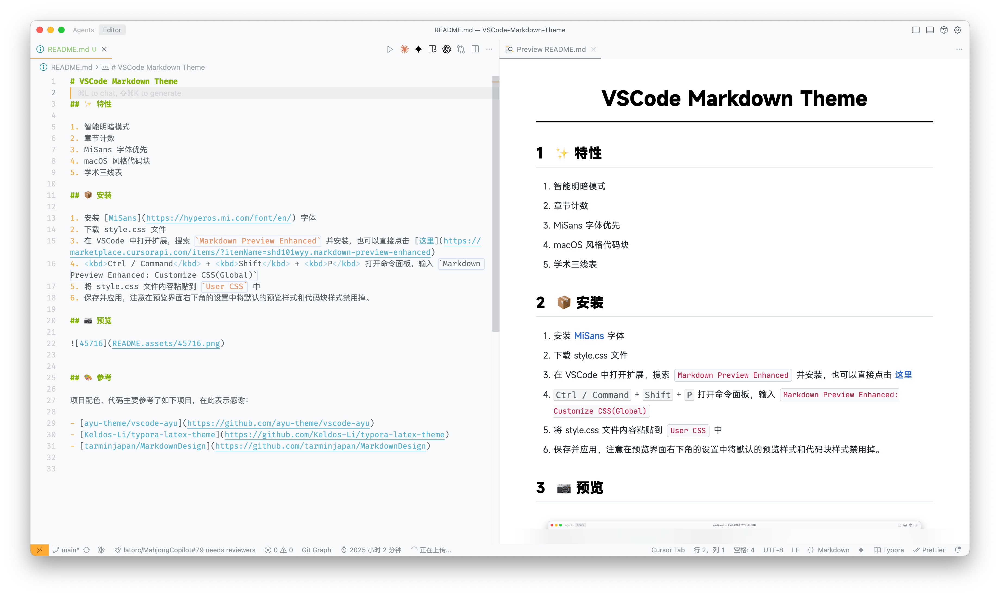
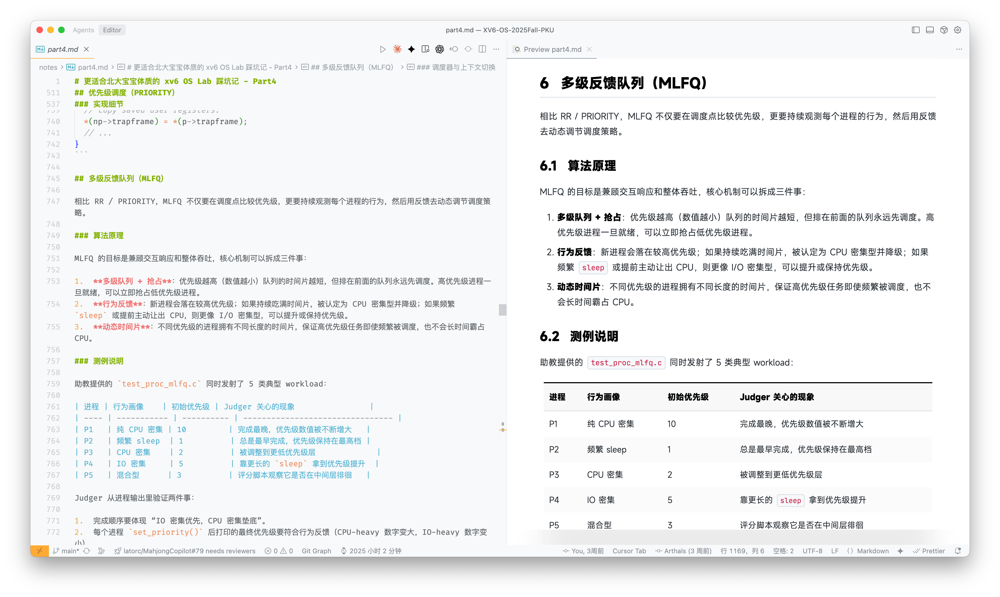
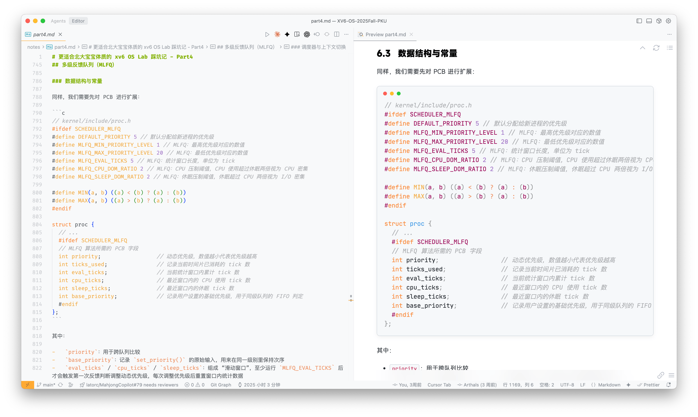

# VSCode Markdown Theme

[English](README.md) | [简体中文](README_zh-CN.md)

## ✨ Features

1. Intelligent light/dark mode
2. Section numbering
3. MiSans font priority
4. macOS-style code blocks
5. Academic three-line tables

## 📦 Installation

1. Install the [MiSans](https://hyperos.mi.com/font/en/) font
2. Download the [style.css](style.css) file
3. Open extensions in VSCode, search for `Markdown Preview Enhanced` and install it, or click [here](https://marketplace.cursorapi.com/items/?itemName=shd101wyy.markdown-preview-enhanced)
4. Press <kbd>Ctrl / Command</kbd> + <kbd>Shift</kbd> + <kbd>P</kbd> to open the command palette, then type `Markdown Preview Enhanced: Customize CSS(Global)`
5. Paste the contents of the style.css file into `User CSS`
6. Save and apply. Note: Disable the default preview style and code block style in the settings at the bottom right of the preview interface.

## 📷 Preview

## 🎨 References

This project's color scheme and code are mainly based on the following projects, with thanks:

-   [ayu-theme/vscode-ayu](https://github.com/ayu-theme/vscode-ayu)
-   [Keldos-Li/typora-latex-theme](https://github.com/Keldos-Li/typora-latex-theme)
-   [tarminjapan/MarkdownDesign](https://github.com/tarminjapan/MarkdownDesign)

## 📜 License

This project is licensed under the MIT License.
